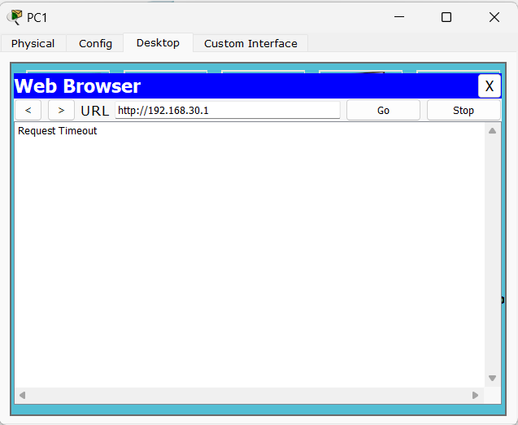

## ACCESS CONTROL LIST (ACL)

ACL is a network filter that is often used by network devices like routers and switches to control network traffic.

ACLs are used to filter traffic based on the source and destination IP address, protocol, port or port range, or even the type of traffic.

There are two types of ACLs:

1. [Standard ACL](#standard-acl)
2. [Extended ACL](#extended-acl)

| Topic       | Standard ACL                                                                           | Extended ACL                                                                                                                                      |
| ----------- | -------------------------------------------------------------------------------------- | ------------------------------------------------------------------------------------------------------------------------------------------------- |
| Syntax      | Uses only source IP address for filtering.                                             | Uses source and destination IP addresses, as well as protocol and port numbers for filtering.                                                     |
| Range       | Numbered from 1 to 99 and 1300 to 1999.                                                | Numbered from 100 to 199 and 2000 to 2699.                                                                                                        |
| Scope       | Can only filter traffic based on `source address`.                                     | Can filter traffic based on source and destination addresses, as well as specific protocols and port numbers.                                     |
| Positioning | Should be placed as close to the `destination` as possible.                            | Should be placed as close to the `source` as possible.                                                                                            |
| Uses        | Typically used to block traffic from specific hosts or networks.                       | Used to provide more granular control over traffic flows.                                                                                         |
| Efficiency  | More efficient than extended ACLs because they require less processing power.          | Less efficient than standard ACLs because they require more processing power.                                                                     |
| Security    | Less secure than extended ACLs because they can only filter based on source addresses. | More secure than standard ACLs because they can filter based on source and destination addresses, as well as specific protocols and port numbers. |
| Complexity  | Less complex than extended ACLs.                                                       | More complex than standard ACLs.                                                                                                                  |

### GUIDELINES FOR ACL

1. ACLs are always processed from `top to down` in sequential order.

2. A packet is compared with ACL conditions until it finds a match.

3. Once a match is found for the packet, no further comparison will be done for that packet.

4. The interface will take action based on the match condition. There are two possible actions; permit and deny.

5. If the permit condition matches, the packet will be allowed to pass from the interface.

6. If deny condition matches, the packet will be destroyed immediately.

7. Every ACL has a `default deny statement` at end of it.

8. If a packet does not meet with any condition, it will be destroyed (by the `last deny condition` mentioned in the 7th guideline).

9. `Empty ACL will permit all traffic` by default. Implicit deny condition will not work.

10. Implicit (default last deny) condition would work only if ACL has at `least one user-defined condition`.

11. ACL can filter only the traffic passing from the interface which the ACL applied.

Eg: If you apply ACL on `Fa0/0` interface, it will filter only the traffic passing from `Fa0/0` interface. Not from `Fa0/1` or `Fa1/0` or any other interface.

12. Standard ACL can filter only the source IP address.

13. Standard ACL should be placed near the `destination` devices.

14. Extended ACL should be placed near the `source` devices.

15. Each ACL needs a unique number or name (1 to 99 for standard ACL or 100 to 199 for extended ACL or unique name given by the user).

16. We can have only one ACL applied to an interface in each direction; inbound and outbound. Only `one ACL can be applied to an interface in each direction`. If you apply another ACL to the same interface in the same direction, the new ACL will `overwrite the previous one`.

### STANDARD ACL

Standard ACLs are used to filter traffic based on the source IP address of the packet.</br>

#### SUMMERY FOR THIS SECTION

- [WHAT IS TTL?](#what-is-ttl)
- [WHAT IS WILDCARD MASK?](#what-is-wildcard-mask)
- [HOW TO REMOVE ACL?](#how-to-remove-acl)
- [WHAT HAPPENS IF WE PUT ACL TO SOURCE DEVICE?](#what-happens-if-we-put-acl-to-source-device)

#### STANDARD ACL WITH CISCO PACKET TRACER

1. Design the following network and load it in to the Cisco Packet Tracer.


2. Name R1, R2, and R3 as `Moratuwa`, `Colombo`, and `Matara` respectively.

- Changing host name for R1 is given below. You can change the host name for R2 and R3 in the same way.

```
Router>en
Router#config t
Router(config)#hostname Moratuwa
Moratuwa(config)#
```

3. Configure IP addresses , serial interfaces, and default gateways for all three routers. Assign clock rate as 64000 for selected interfaces.

- Configuration for only one router is given below. You can configure the other two routers in the same way according to the network diagram.

```
Moratuwa(config)#interface fa0/0
Moratuwa(config-if)#ip address 172.17.0.100 255.255.0.0
Moratuwa(config-if)#no shutdown
Moratuwa(config-if)#ex

Moratuwa(config)#interface se2/0
Moratuwa(config-if)#ip address 10.0.0.2 255.0.0.0
Moratuwa(config-if)#no shutdown
Moratuwa(config-if)#exit

Moratuwa(config)#interface se3/0
Moratuwa(config-if)#ip address 11.0.0.1 255.0.0.0
Moratuwa(config-if)#clock rate 64000
Moratuwa(config-if)#no shutdown
```

4. Configure the PC’s. (IP address, Subnet Mask and Default Gateway).

- You should configure from `desktop` then `ip configuration` and then `ip address` and `subnet mask` and `default gateway` as given below.

<p align="center">
  
</p>

5. Configure the routers with RIP to enable dynamic routing.

- R1, directly connected with `10.0.0.0/8`, `11.0.0.0/8` and `172.17.0.0/16`.
- R2, directly connected with `11.0.0.0/8`, `12.0.0.0/8` and `192.168.10.0/24`.
- R3, directly connected with `10.0.0.0/8`, `12.0.0.0/8` and `172.16.0.0/16`.

- Configuration for R1 is given below. You can configure the other two routers in the same way according to the network diagram.

```
Moratuwa(config)#router rip
Moratuwa(config-router)#network 10.0.0.0
Moratuwa(config-router)#network 11.0.0.0
Moratuwa(config-router)#network 172.17.0.0
```

6. Use the `ping` command to check the connectivity between the routers.

- You can use the `ping` command as given below.

```
PC>ping 172.17.0.1

Pinging 172.17.0.1 with 32 bytes of data:
Reply from 172.17.0.1: bytes=32 time=2ms TTL=126
Reply from 172.17.0.1: bytes=32 time=1ms TTL=126
Reply from 172.17.0.1: bytes=32 time=1ms TTL=126

Ping statistics for 172.17.0.1:
    Packets: Sent = 4, Received = 3, Lost = 1 (25% loss),
Approximate round trip times in milli-seconds:
    Minimum = 1ms, Maximum = 2ms, Average = 1ms
```

##### WHAT IS TTL ?

- TTL stands for `Time To Live`.
- It is a value in an Internet Protocol (IP) packet that tells a network router whether or not the packet has been in the network too long and should be discarded.
- In other words, it specifies `how many hops (routers)` the packet is allowed to travel `before being destroyed`.

7. Apply the Standard Access Control List Configuration for the following.

<ol type="a">
  <li> PC1 is allowed to access network 172.16.0.0.</li>
  <li> PC2 is not allowed to access 172.16.0.0 network.</li>
</ol>

- For the first requirement (PC1 is `allowed` to access network 172.16.0.0), we do not need to configure anything. Because by default, `all the traffic is allowed` to pass through the router.

- For the second requirement (PC2 is `not allowed` to access 172.16.0.0 network), we have to configure the router. We have to configure the router in two ways.

  - By using `access-list` command.
  - By using `access-group` command.

- When configuring standard ACL, we have to put ACL to the `destination` router. In this case, we have to put ACL to the `R3` router.

```
ip access-list standard <acl-number>
deny <source ip-address> <wildcard>
```

##### WHAT IS WILDCARD MASK ?

- A wildcard mask is a mask of `bits` that indicates which parts of an IP address are available for examination.

- We are using `0` to indicate that the corresponding bit in the IP address must match the corresponding bit in the wildcard mask and `1` to indicate that the corresponding bit in the IP address is not examined.

- For example, in here `192.168.10.1` to identify ip address we have to match all the bits of the ip address. So, in this case, wildcard mask is 0.0.0.0

- For another example, assume you want to block entire `192.168.10.0` network. Then to identify ip address we have to match first 3 octets of the ip address. So, in this case, wildcard mask is `0.0.0.255`

  - We do not need to match the last octet. So, we are using `255` to indicate that the corresponding bit in the IP address is not examined, because we use `1` to indicate that the corresponding bit in the IP address is not examined.
    (note : 255 = 11111111)

```
interface <interface-name>
ip access-group <acl-number> <in/out>
```

`in/out` : inbound means traffic coming to the router and outbound means traffic going out of the router. In this case, we have to use `out` because we are going to block the traffic going out of the router. (note: packets are coming outside the router.)

```
Matara(config)#ip access-list standard 1
Matara(config-std-nacl)#deny 192.168.10.1 0.0.0.0
Matara(config-std-nacl)#permit any
Matara(config-std-nacl)#exit

Matara(config)#interface fa0/0
Matara(config-if)#ip access-group 1 out
```

##### HOW TO REMOVE ACL ?

- To remove ACL, we have to use `no` command with existing command.

```
Matara(config)#no ip access-list standard 1
```

- This will empty the ACL with number 1. However, router will still checking `access-group 1` command. But it will not block any traffic because ACL is empty.
  (Guideline No.9 : `Empty ACL will permit all traffic` by default. Implicit deny condition will not work. )

- However, if we want to remove `access-group 1` command, we have to use `no` command with existing command.

```
Matara(config)#interface fa0/0
Matara(config-if)#no ip access-group 1 out
```

##### WHAT HAPPENS IF WE PUT ACL TO SOURCE DEVICE ?

- Assume a scenario, instead of add ACL to destination router, we add ACL to source router. In this case, we have to add ACL to `R1` router.

```
Colombo(config)#ip access-list standard 1
Colombo(config-std-nacl)#deny 192.168.10.1 0.0.0.0
Colombo(config-std-nacl)#permit any
Colombo(config-std-nacl)#exit

Colombo(config)#interface fa0/0
Colombo(config-if)#ip access-group 1 in
Colombo(config-if)#
```

- PROBLEMS:
  - In standard ACL, it can only filter based on `source IP` address. Therefore, PC2 can't access another networks too.

### EXTENDED ACL

- Extended ACL can filter based on `source IP` address, `destination IP` address, `source port` and `destination port`.

- Extended ACL is added to the `source` router.

#### SUMMARY FOR THIS SECTION

- [WHAT HAPPENS IF WE PUT ACL TO DESTINATION DEVICE ?](#what-happens-if-we-put-acl-to-destination-device)
- [HOW TO CHECK THE CONNECTIVITY WEB SERVER ?](#how-to-check-the-connectivity-web-server)
- [HOW TO CHECK THE CONNECTIVITY FTP SERVER ?](#how-to-check-the-connectivity-ftp-server)
- [HOW TO UPLOAD & DOWNLOAD FILES USING FTP SERVER ?](#how-to-upload--download-files-using-ftp-server)

#### EXTENDED ACL WITH CISCO PACKET TRACER

1. Design the following network using Cisco Packet Tracer.


2. Configure the IP addresses for the routers and PCs and configure Serial and Ethernet interfaces of routers and assign clock rate as 64000 for selected interfaces.

- Configuration for ROUTER0 (R0). You can configure other routers in the same way.

```
Router>en
Router#config t
Router(config)#interface fa0/0
Router(config-if)#ip address 192.168.30.100 255.255.255.0
Router(config-if)#no shutdown
Router(config-if)#ex

Router(config)#interface se2/0
Router(config-if)#ip address 10.0.0.1 255.0.0.0
Router(config-if)#clock rate 64000
Router(config-if)#no shutdown
Router(config-if)#ex

Router(config)#interface se3/0
Router(config-if)#ip address 11.0.0.1 255.0.0.0
Router(config-if)#no shutdown
```

3. Configure the routers with RIP to enable dynamic routing.

- ROUTER0, directly connected with `10.0.0.0/8`, `11.0.0.0/8` and `192.168.30.0/24`.
- ROUTER1, directly connected with `10.0.0.0/8`, `12.0.0.0/8` and `192.168.10.0/24`.
- ROUTER2, directly connected with `11.0.0.0/8`, `12.0.0.0/8` and `192.168.20.0/24`.

- Configuration for ROUTER0 (R0). You can configure other routers in the same way.

```
Router(config)#router rip
Router(config-router)#network 192.168.30.0
Router(config-router)#network 10.0.0.0
Router(config-router)#network 11.0.0.0
```

4. Apply the Extended Access Control List Configuration for the following.

<ol type="a">
  <li> PC1 is not allowed to access the web server in PC5.</li>
  <li> PC3 is not allowed to access the ftp server in PC5.</li>
  <li> PC2 is not allowed to access the ftp server in PC5.</li>
  <li> Any other traffic will be permit.</li>
</ol>

```
deny <protocol> <source-ip> <source-wildcard> <destination-ip> <destination-wildcard> <source-port> <operation> <destination-port>
```

protocol:

```
  ahp    Authentication Header Protocol
  eigrp  Cisco's EIGRP routing protocol
  esp    Encapsulation Security Payload
  gre    Cisco's GRE tunneling
  icmp   Internet Control Message Protocol
  ip     Any Internet Protocol
  ospf   OSPF routing protocol
  tcp    Transmission Control Protocol
  udp    User Datagram Protocol
```

Operations:

```
  eq           Match only packets on a given port number
  established  established
  gt           Match only packets with a greater port number
  lt           Match only packets with a lower port number
  neq          Match only packets not on a given port number
  range        Match only packets in the range of port numbers
```

Port Numbers:

```
<0-65535>  Port number
  domain     Domain Name Service (DNS, 53)
  ftp        File Transfer Protocol (21)
  pop3       Post Office Protocol v3 (110)
  smtp       Simple Mail Transport Protocol (25)
  telnet     Telnet (23)
  www        World Wide Web (HTTP, 80)
```

- PC1 and PC2 are in same network, so we can apply rule a) and c) for the `ROUTER1`.

```
Router(config)#ip access-list extended 110
Router(config-ext-nacl)#deny tcp 192.168.10.1 0.0.0.0 192.168.30.1 0.0.0.0 eq 80
Router(config-ext-nacl)#deny tcp 192.168.10.2 0.0.0.0 192.168.30.1 0.0.0.0 eq 21
Router(config-ext-nacl)#permit ip any any
Router(config-ext-nacl)#exit

Router(config)#interface fa0/0
Router(config-if)#ip access-group 110 in
```

- Note:

  - Real-time scenario : `order does not matter`
  - Packet Tracer : `order matters`

- PC3 is not allowed to access the web server in PC5, so we can apply rule b) for the `ROUTER2`.

```
Router(config)#ip access-list extended 120
Router(config-ext-nacl)#deny tcp 192.168.20.1 0.0.0.0 192.168.30.1 0.0.0.0 eq 21
Router(config-ext-nacl)#permit ip any any
Router(config-ext-nacl)#exit

Router(config)#interface fa0/0
Router(config-if)#ip access-group 120 in
```

##### WHAT HAPPENS IF WE PUT ACL TO DESTINATION DEVICE ?

- If we apply ACL to the destination interface, the packet will be forwarded to the destination and then it will be dropped. So, it is a waste of bandwidth.
- Unneccessary packets will transfer from every router, so it will increase the network traffic.

5. Check the connectivity between the PCs.

##### HOW TO CHECK THE CONNECTIVITY WEB SERVER ?

- Select the `PC1` and click on `Desktop` tab. Then, click on `Web Browser` icon.

- Type `ip address of web server` in the address bar and press `Go`.

- If you get the following page, then the connectivity is successful. And if you get `Request Timedout` error, then the connectivity is unsuccessful.

<table>
  <tr>
    <td></td>
    <td></td>
  </tr>
</table>

##### HOW TO CHECK THE CONNECTIVITY FTP SERVER ?

- Select the `PC1` and click on `Desktop` tab. Then, click on `Command Prompt` icon.

- Type `ftp <ip address of ftp server>` in the command prompt and press `Enter`.

- Then type `cisco` as username and `cisco` as password.

- If you get the left image, then the connectivity is successful. And if you get right image, then the connectivity is unsuccessful.

<table>
  <tr>
    <td></td>
    <td></td>
  </tr>
</table>

##### HOW TO UPLOAD & DOWNLOAD FILES USING FTP SERVER ?

- Select the `PC` and click on `Desktop` tab. Then, click on `Command Prompt` icon.

- Type `ftp <ip address of ftp server>` in the command prompt and press `Enter`.

- Then type `cisco` as username and `cisco` as password.

- Type `dir` to list the files in the ftp server.

- Type `put <file name>` to upload the file to the ftp server.

- Type `get <file name>` to download the file from the ftp server.

<table>
  <tr>
    <td></td>
    <td></td>
  </tr>
</table>

- Type `quit` to exit from the ftp server.

- You can create or view files using `Text` in the `Desktop` tab.
